https://capsule-render.vercel.app/api?type=waving&color=0:0f2027,100:203a43&height=200&section=header&text=Rupam&fontColor=ffffff&fontSize=60
<div align="center">
👋 Hey, I'm Rupam! 🚀
🧠 BCA Student | 💻 C • C++ • Python | 🤖 🚀 Future Systems & Space-Tech Enthusiast
https://readme-typing-svg.herokuapp.com/?font=Fira+Code&pause=1000&color=36BCF7&center=true&vCenter=true&width=435&lines=Learning+Fundamentals+First;Building+Systems+That+Matter;Exploring+Robotics+%26+IoT;Future+Aerospace+Engineer
</div>

🎯 About Me
pythonclass Rupam:
    def __init__(self):
        self.username = "rupamr01"
        self.education = "BCA Student (First Year)"
        self.focus = ["C", "C++", "Python"]
        self.interests = ["Robotics", "IoT", "Aerospace", "Embedded Systems"]
        self.motto = "Strong fundamentals first, advanced systems later"
    
    def current_status(self):
        return "Building strong foundations 💪"

💡 Learning the old-school way: strong fundamentals first, advanced systems later.

🎯 Beliefs I Code By:

⚡ Strong basics create strong engineers
🔧 Hardware never forgives weak logic
📈 Consistency beats motivation
🎓 Depth > Speed | Logic > Noise


🛠️ Tech Stack & Learning Arsenal
<div align="center">
💻 Languages
https://img.shields.io/badge/C-00599C?style=for-the-badge&logo=c&logoColor=white
https://img.shields.io/badge/C++-00599C?style=for-the-badge&logo=cplusplus&logoColor=white
https://img.shields.io/badge/Python-3776AB?style=for-the-badge&logo=python&logoColor=white
🧰 Tools & Platforms
https://img.shields.io/badge/VS_Code-007ACC?style=for-the-badge&logo=visual-studio-code&logoColor=white
https://img.shields.io/badge/Git-F05032?style=for-the-badge&logo=git&logoColor=white
https://img.shields.io/badge/GitHub-181717?style=for-the-badge&logo=github&logoColor=white
https://img.shields.io/badge/Linux-FCC624?style=for-the-badge&logo=linux&logoColor=black
</div>
📚 Core Concepts in Focus:

✅ Logic building & problem solving
✅ Loops, conditions, functions
✅ Arrays & strings
✅ Modular, readable code
🔄 File handling & data structures (learning)


🔭 Interests & Future Domains
<table>
  <tr>
    <td align="center" width="25%">
      
      <br><b>Robotics</b>
      <br><sub>Sensors, Motors, Automation</sub>
    </td>
    <td align="center" width="25%">
      
      <br><b>IoT</b>
      <br><sub>Connected Devices & Systems</sub>
    </td>
    <td align="center" width="25%">
      
      <br><b>Aerospace</b>
      <br><sub>Flight Software & Navigation</sub>
    </td>
    <td align="center" width="25%">
      
      <br><b>Embedded Systems</b>
      <br><sub>C/C++ Close to Hardware</sub>
    </td>
  </tr>
</table>

🎯 Currently learning the foundations required to enter these domains the right way.


📂 Projects & Practice
🚀 Featured Projects
<details open>
<summary><b>🔢 C Calculator</b></summary>
<br>
Arithmetic calculator in C<br>
<code>Focus:</code> Input handling, control flow, clean structure
</details>
<details>
<summary><b>📊 Attendance Calculator</b></summary>
<br>
Program to calculate attendance percentage and conditions<br>
<code>Focus:</code> Logic and decision-making
</details>
<details>
<summary><b>🐍 Python Practice Programs</b> (ongoing)</summary>
<br>
Variables, loops, conditions, beginner logic problems<br>
<code>Focus:</code> Building strong Python fundamentals
</details>

💻 More projects will be added as skills mature.


📊 GitHub Stats & Grind
<div align="center">


📈 Contribution Graph
https://github-readme-activity-graph.vercel.app/graph?username=rupamr01&theme=tokyo-night&hide_border=true
</div>

🎯 Current Focus
<div align="center">
🎓 Learning🔧 Building🚀 PreparingC & C++ FundamentalsProblem-Solving SkillsRobotics ProjectsPython AutomationLogic & AlgorithmsIoT SystemsData StructuresClean Code PracticesAerospace Dreams
</div>

🧠 Philosophy (How I Think)
<div align="center">
```
╔═══════════════════════════════════════╗
║  "Trends fade. Fundamentals compound" ║
╚═══════════════════════════════════════╝
```
🎯 My Approach:

⏰ I respect systems that stood the test of time
🚫 I don't rush stacks I don't understand
🏗️ I believe good engineers are built, not marketed

💎 Core Values:
Discipline > Motivation
Depth > Speed
Logic > Noise
</div>

🧪 Learning Style

```mermaid
graph LR
    A[📖 Read] --> B[✍️ Implement]
    B --> C[🧠 Break]
    C --> D[🔁 Fix]
    D --> E[🎯 Master]
    E --> A
```

<div align="center">

</div>

📖 Read concepts thoroughly
✍️ Implement them in code
🧠 Break things intentionally
🔁 Fix and understand why
🎓 Explain concepts simply


🚫 What I'm NOT Doing (Intentionally)
<div align="center">
❌ Avoiding✅ Focusing OnBlindly copying reposUnderstanding conceptsJumping frameworksBuilding fundamentalsFlexing half-baked skillsReal learning & growthFollowing trendsMastering basics
🎮 I'm playing a LONG GAME
</div>

🛤️ Roadmap (Next Phase)
Phase 1 (Current) 🔵
├── Advanced C (pointers, file handling)
├── OOP with C++
└── Python scripting & automation

Phase 2 (Upcoming) 🟡
├── Data structures & algorithms
├── Embedded systems intro
└── IoT project foundations

Phase 3 (Future) 🟢
├── Robotics projects
├── Aerospace applications
└── System-level programming

🏆 Achievements & Milestones
<div align="center">
https://img.shields.io/github/followers/rupamr01?style=social
https://img.shields.io/github/stars/rupamr01?style=social
https://github-profile-trophy.vercel.app/?username=rupamr01&theme=tokyonight&no-frame=true&row=1&column=6
</div>

🐍 Contribution Snake
<div align="center">
https://github.com/rupamr01/rupamr01/blob/output/github-contribution-grid-snake.svg
</div>

📫 Let's Connect
<div align="center">
https://img.shields.io/badge/GitHub-rupamr01-181717?style=for-the-badge&logo=github
https://img.shields.io/badge/Email-Contact_Me-D14836?style=for-the-badge&logo=gmail&logoColor=white
👀 Profile Views
https://komarev.com/ghpvc/?username=rupamr01&label=Profile%20Views&color=0e75b6&style=for-the-badge
</div>

<div align="center">
🏁 Final Note

Still learning. Still building. Still dangerous with time.

If you're here, you're watching the early phase.
The real work is happening quietly. 🔥
💭 No noise. No pretending. Just progress.
</div>

<div align="center">
https://capsule-render.vercel.app/api?type=waving&color=0:203a43,100:0f2027&height=120&section=footer
</div>
